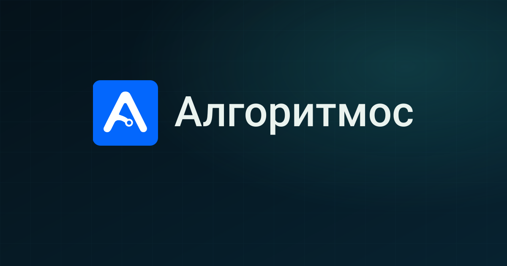

# Алгоритмос — официальный сайт

Премиальный корпоративный сайт российской ИТ-компании полного цикла «Алгоритмос».
**Результат через технологии.**



## Возможности

- **Интерактивный 3D-hero** на Three.js: стеклянный тор-узел, металлическое ядро,
  облако частиц, параллакс за указателем. Пауза в неактивной вкладке,
  сокращение движения при `prefers-reduced-motion`, CSS-постер при отсутствии WebGL.
- **11 посадочных страниц услуг** (`/services/[slug]`) со статической генерацией,
  хлебными крошками и Schema.org-разметкой.
- **Рабочая форма заявки**: серверный экшен Next.js, валидация Zod,
  интеграция с Bitrix24, honeypot от ботов, передача UTM-меток в CRM.
- **SEO из коробки**: метаданные, Open Graph, `sitemap.xml`, `robots.txt`,
  веб-манифест, JSON-LD (`Organization`, `Service`, `BreadcrumbList`).
- **Доступность (WCAG 2.2 AA)**: семантические landmark-области, skip-link,
  видимый фокус, управление с клавиатуры, `aria-live` статусы формы.
- **Детали интерфейса**: прогресс чтения страницы, подсветка активного раздела
  в меню, бегущая строка направлений, плавные reveal-анимации, кнопка «наверх»,
  кастомный скроллбар, фирменная страница 404.
- **Яндекс.Метрика** (опционально): цели `cta_click`, `form_open`,
  `lead_success`, `contacts_view`.

## Стек

Next.js 15 (App Router) · TypeScript · Tailwind CSS · Three.js · Zod

## Быстрый старт

```bash
npm install
cp .env.example .env.local   # заполните BITRIX_WEBHOOK_URL
npm run dev                  # http://localhost:9020
```

Production-сборка:

```bash
npm run build
npm start
```

## Переменные окружения

| Переменная | Назначение | Обязательная |
| --- | --- | --- |
| `BITRIX_WEBHOOK_URL` | Вебхук Bitrix24 `crm.lead.add` для приёма заявок | Да (для формы) |
| `NEXT_PUBLIC_SITE_URL` | Базовый URL для canonical, sitemap, OG | Рекомендуется |
| `NEXT_PUBLIC_YM_ID` | Номер счётчика Яндекс.Метрики | Нет |

Секреты хранятся только на сервере: `.env.local` не коммитится (см. `.gitignore`).

## Структура

```
src/
├── app/
│   ├── page.tsx              # Главная (hero, услуги, подход, FAQ, контакты)
│   ├── services/[slug]/      # Детальные страницы 11 направлений (SSG)
│   ├── privacy/              # Политика конфиденциальности
│   ├── actions.ts            # Серверный экшен заявки в Bitrix24
│   ├── sitemap.ts robots.ts manifest.ts icon.svg
│   └── not-found.tsx         # Фирменная 404
├── components/
│   ├── layout/               # Header, Footer
│   ├── sections/             # Hero, About, Process, Services, WhyUs, Faq, Contacts
│   ├── three/                # 3D-сцена OrbitScene
│   ├── ui/                   # Logo, Reveal, Marquee, BackToTop, ScrollProgress…
│   └── analytics/            # Яндекс.Метрика
├── data/                     # Контент: услуги, контакты, FAQ
└── lib/                      # Аналитика и утилиты
```

## Деплой

Приложению нужен Node.js-рантайм (форма работает через серверный экшен):

- **Vercel / Netlify** — из коробки;
- **VPS** — `npm run build && npm start` за reverse-proxy (nginx), Node.js ≥ 18.18;
- **Docker** — `next build` + `next start` в контейнере Node 20.

## Контакты

ООО «Алгоритмос» · Уфа, Республика Башкортостан
[info@algorithmos.ru](mailto:info@algorithmos.ru) · +7 (919) 152-18-62

© Алгоритмос. Все права защищены.
